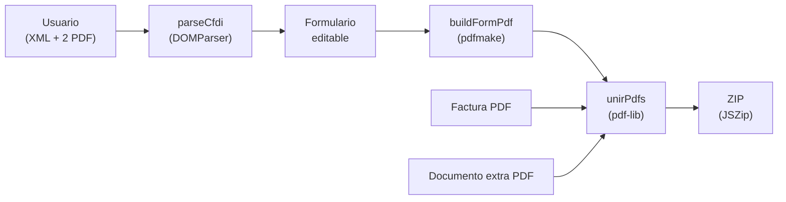

# Recuperación de facturas

App **100% frontend** que arma el paquete de **reembolso de gastos médicos**
(formato IBM / AON) a partir de una factura CFDI.

Arrastras tres archivos —el **XML** de la factura, su **PDF**, y un **documento
extra**— y la app:

1. Lee los datos del CFDI (XML).
2. Llena el formato oficial de reembolso.
3. Lo une con la factura PDF y el documento extra en un solo PDF.
4. Descarga un **ZIP** con el PDF ensamblado + el XML.

Todo ocurre en el navegador: **no hay backend**, nada se sube a ningún
servidor. Se despliega en GitHub Pages.



## De dónde sale cada dato

Un CFDI **no contiene todos** los campos del formato, así que la app prellena
lo que puede y deja el resto editable.

| Sección | Campo | Fuente |
|---|---|---|
| Datos del recibo | Fecha de consulta | `CITA:` de la descripción (año de `Fecha`) |
| | Importe | `Total` del comprobante |
| | Número de factura | `Serie`+`Folio`, o el `UUID` si no hay folio |
| Datos del médico | Nombre | `Emisor` (separado en paterno/materno/nombre) |
| | Especialidad | `CONSULTA:` de la descripción |
| Datos del paciente | Nombre | `PACIENTE:` de la descripción (o el `Receptor`) |
| | Parentesco | `TITULAR` si el paciente es el titular, `HIJA` si comparte apellido; si no, manual |
| | Fecha de nacimiento | **No viene en el CFDI** — se captura (se recuerda por paciente) |
| Fecha de entrega | Día de ejecución | Fecha de hoy |
| Titular, depósito, firma | — | **Perfil del titular** (ver abajo) |

El desglose de nombres usa una heurística (los dos últimos tokens son los
apellidos); por eso **todos los campos son editables** antes de generar, para
los casos ambiguos (apellidos compuestos, nombre del paciente distinto, etc.).

## Perfil del titular

Los datos de quien reclama el reembolso —nombre, número de empleado, CLABE,
banco, lugar y firma escaneada— **no están en el código**: se capturan una vez
en el panel *Datos del titular y depósito* y se guardan en el `localStorage` del
navegador (clave `recfact:perfil`), así que cada persona que abre la app usa los
suyos y nada sensible viaja en el bundle publicado.

La firma es **opcional**: sin ella el PDF deja una línea en blanco para firmar a
mano. Si se sube, se reescala a 600 px de ancho y se guarda como PNG.

Mientras falte algún dato obligatorio del perfil, el botón *Generar ZIP* queda
deshabilitado.

## Fidelidad del formato

El PDF del formato se genera con **pdfmake** (texto vectorial nítido y la firma
escaneada del titular, si se configuró), reproduciendo el layout del formato original
—secciones, sombreados y textos legales—. Es una **reproducción fiel**, no una
conversión byte a byte del Excel (eso solo lo garantizaría abrir el XLSX en
Excel/LibreOffice).

## Nombres de salida

El PDF ensamblado y el ZIP toman el **mismo nombre base que el XML**
(p. ej. `597d4156-….zip` con `597d4156-….pdf` + `597d4156-….xml` adentro).

## Desarrollo

```bash
cd frontend
npm install
npm run dev      # servidor local
npm run build    # compila a dist/
npm run deploy   # build + publish a GitHub Pages (gh-pages)
```

## Estructura

```
src/base/                 Base.xlsx + ejemplos (local, no versionado)
frontend/
  src/facturas/
    parseCfdi.ts          Lee el CFDI y prellena el formulario
    buildFormPdf.ts       Reproduce el formato en PDF (pdfmake)
    assemble.ts           Une PDFs (pdf-lib) y empaqueta ZIP (JSZip)
    constants.ts          Empresa, aseguradora y textos legales (constantes)
    perfil.ts             Perfil del titular en localStorage + firma
    util.ts               Fechas, separación de nombres, formato de importe
    Home.tsx              UI: perfil + carga de archivos + formulario + generación
```
